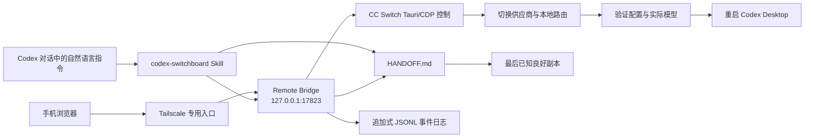

# Codex Switchboard

用自然语言或手机安全切换 Codex Desktop 模型，并在重启前保存交接上下文。

Codex Switchboard 是一个面向 Windows 的 Codex Skill。它组合 Tailscale、CC Switch 和本机 Remote Bridge，让用户无需依赖鼠标坐标或悬停按钮，就能：

- 在任意仍可接收消息的 Codex 任务中说“切换模型到 DeepSeek”或“切回 GPT”；
- 从手机浏览器打开独立控制台，作为模型无关的带外恢复入口；
- 在切换前备份交接日志，并持续追加机器可读的事件记录；
- 验证 CC Switch 供应商、路由接管和 Codex 实际模型后再重启客户端。

> [!IMPORTANT]
> 本项目不负责同步不同模型前端之间的聊天记录。如果切换模型后原任务不可见，请使用手机控制台切回原模型。交接日志用于保存操作上下文，不会复制 Codex 或其他前端的专有会话数据库。

## 工作原理



Bridge 不进行屏幕识别，也不移动鼠标。它通过仅绑定回环地址的 WebView2 调试端口调用 CC Switch 自身的 Tauri 命令。

## 功能

- 自然语言模型切换：支持供应商 ID、供应商名称或配置模型名。
- 模糊匹配保护：匹配结果不唯一时拒绝猜测，要求用户明确选择。
- 路由自动处理：第三方 Chat Completions 供应商可启用 CC Switch 本地路由接管；切回官方供应商时关闭接管。
- 切换后验证：检查当前供应商、路由端口和 `~/.codex/config.toml` 中的实际模型。
- Codex 自动重启：仅在验证成功后执行。
- 手机控制台：电脑与手机位于同一 Tailnet 时，可从手机独立触发切换。
- 双层日志保障：人工可读交接文件、切换前快照和追加式 JSONL 事件。
- 无自动回退计时器，不创建桌面快捷方式。

## 系统要求

- Windows 10 或 Windows 11；
- Microsoft Store 版 Codex Desktop；
- [Tailscale](https://tailscale.com/download/windows)，电脑和手机登录同一个 Tailnet；
- [CC Switch](https://github.com/farion1231/cc-switch/releases)，至少已有一个经过测试的 Codex 供应商；
- Node.js LTS。

可通过 Windows Package Manager 安装 Tailscale 和 Node.js：

```powershell
winget install --id Tailscale.Tailscale --exact `
  --accept-package-agreements --accept-source-agreements

winget install --id OpenJS.NodeJS.LTS --exact `
  --accept-package-agreements --accept-source-agreements
```

CC Switch 只应从项目的 [GitHub Releases](https://github.com/farion1231/cc-switch/releases) 下载 Windows MSI，或使用你已有的便携版。不要从第三方下载站获取。

## 安装 Skill

克隆到个人 Codex Skills 目录：

```powershell
git clone https://github.com/Zachary-262625/codex-switchboard.git `
  "$env:USERPROFILE\.codex\skills\codex-switchboard"
```

也可以在 CC Switch 的 Skills 管理页面中，通过本 GitHub 仓库安装。安装后重新启动 Codex Desktop，让新的 Skill 进入后续任务上下文。

## 初次配置

### 1. 配置 CC Switch

打开 CC Switch，为 Codex 添加或导入供应商，并在 CC Switch 内测试目标模型。API Key、订阅凭据等秘密只在 CC Switch 中填写，不要发送到聊天或写入日志。

### 2. 部署 Remote Bridge

在 Skill 目录中运行：

```powershell
Set-Location "$env:USERPROFILE\.codex\skills\codex-switchboard"
.\scripts\deploy-bridge.ps1
```

如果使用便携版 CC Switch，并且脚本无法自动发现它：

```powershell
.\scripts\deploy-bridge.ps1 `
  -CcSwitchExe "D:\Apps\CC Switch\cc-switch.exe"
```

部署脚本默认安装到：

```text
%LOCALAPPDATA%\CodexSwitchboard
```

它会配置当前 Windows 用户登录时自动启动 Bridge，但不会创建桌面快捷方式。

### 3. 验证本机状态

```powershell
.\scripts\get-status.ps1
```

检查输出中的：

- `current`：CC Switch 当前 Codex 供应商；
- `providers`：可切换的供应商、模型与路由需求；
- `routing`：本地代理和 Codex 接管状态；
- `codex`：Codex 进程与实际配置模型。

### 4. 启用手机控制台

确认电脑和手机都已连接同一个 Tailnet，然后运行：

```powershell
.\scripts\enable-phone-access.ps1
```

接受 Windows UAC 后，脚本会返回：

- MagicDNS 手机地址；
- Tailscale IP 备用地址；
- 首次登录密码文件路径。

首次登录密码默认保存在：

```text
%LOCALAPPDATA%\CodexSwitchboard\runtime\first-login.txt
```

在手机浏览器打开返回的地址并登录，可以将页面添加到主屏幕。

## 使用方法

### 在 Codex 对话中切换

安装 Skill 后，可以在仍能接收消息的 Codex 任务中发送：

```text
切换模型到 DeepSeek
切回 GPT
切换到 OpenAI Official
使用 codex-switchboard skill 切换模型到 deepseek-v4
```

也可以显式调用：

```text
使用 $codex-switchboard 切换 Codex 到目标供应商，并在重启前写好交接记录。
```

Skill 会先查询当前状态、解析目标、写入交接摘要，再触发切换和重启。由于 Codex 会关闭并重新启动，发起切换的任务可能无法返回最终消息。

### 直接调用脚本

```powershell
.\scripts\switch-model.ps1 `
  -Target "DeepSeek" `
  -HandoffNote "目标：继续修复登录问题；状态：测试已通过；下一步：重启后检查生产配置。"
```

`-Target` 可以是：

- CC Switch 供应商名称；
- 供应商 ID；
- 供应商配置中的模型名。

如果多个供应商同时匹配，脚本会停止并列出候选项。

### 从手机切换

手机控制台实时读取 CC Switch 中已配置的供应商。点击目标供应商并确认后，Bridge 将：

1. 备份当前交接日志；
2. 追加 `prepared` 事件；
3. 切换供应商和路由接管；
4. 验证实际状态；
5. 重启 Codex；
6. 追加 `completed` 或 `failed` 事件。

这个入口不依赖当前 GPT、DeepSeek 或其他模型任务是否可见，因此适合用于“切回 GPT”。

## 交接与事件日志

默认文件位于：

```text
%LOCALAPPDATA%\CodexSwitchboard\HANDOFF.md
%LOCALAPPDATA%\CodexSwitchboard\runtime\HANDOFF.last-known-good.md
%LOCALAPPDATA%\CodexSwitchboard\runtime\handoff-events.jsonl
%LOCALAPPDATA%\CodexSwitchboard\runtime\bridge.log
```

- `HANDOFF.md`：人工可读的当前目标、已完成状态和下一步；
- `HANDOFF.last-known-good.md`：每次切换前的最后已知良好副本；
- `handoff-events.jsonl`：只追加的结构化切换事件；
- `bridge.log`：经过常见令牌格式脱敏的运行日志。

事件日志不会主动截断。不要在交接记录中写入密码、Cookie、API Key 或完整认证配置。

## 安全边界

- Bridge 只监听 `127.0.0.1:17823`；
- 手机访问只绑定电脑的 Tailscale IPv4；
- Windows 防火墙只允许远端 `100.64.0.0/10` 访问该端口；
- 页面需要随机密码，并使用 HttpOnly、SameSite Cookie 和 CSRF Token；
- 不启用 Tailscale Funnel；
- 不配置路由器公网端口转发；
- 不监听 `0.0.0.0`，也不向整个局域网开放；
- 手机页面不能提交任意命令、文件路径或供应商密钥。

页面使用 HTTP，但数据位于 Tailscale 加密隧道内。不要把该端口暴露到公网。

## 限制

- 当前实现只支持 Windows；
- 切换会重启 Codex Desktop，并中断正在运行的任务；
- 自然语言触发依赖当前任务仍能接收消息；
- 手机控制台是任务不可见时的带外恢复入口；
- 本项目不自动同步不同模型前端的会话历史；
- CC Switch 内部命令接口将来发生变化时，Bridge 可能需要兼容性更新。

## 移除

移除手机 Tailnet 入口：

```powershell
.\scripts\disable-phone-access.ps1
```

移除自动启动和网络入口，同时保留交接与事件日志：

```powershell
.\scripts\uninstall-switchboard.ps1
```

仅在明确不再需要历史数据时删除全部运行数据：

```powershell
.\scripts\uninstall-switchboard.ps1 -RemoveData
```

## 项目结构

```text
codex-switchboard/
├─ SKILL.md
├─ agents/
│  └─ openai.yaml
├─ assets/
│  └─ bridge/
│     ├─ server.mjs
│     └─ start-bridge.ps1
├─ references/
│  ├─ architecture.md
│  └─ deployment.md
└─ scripts/
   ├─ common.ps1
   ├─ deploy-bridge.ps1
   ├─ enable-phone-access.ps1
   ├─ disable-phone-access.ps1
   ├─ get-status.ps1
   ├─ switch-model.ps1
   └─ uninstall-switchboard.ps1
```

更详细的代理操作规范见 [SKILL.md](SKILL.md)，部署与安全说明见 [references/deployment.md](references/deployment.md) 和 [references/architecture.md](references/architecture.md)。
